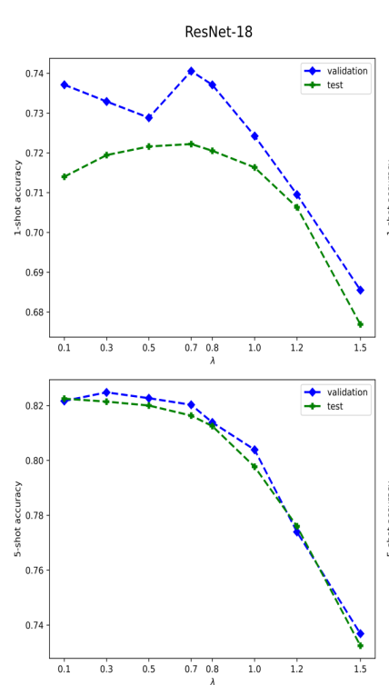
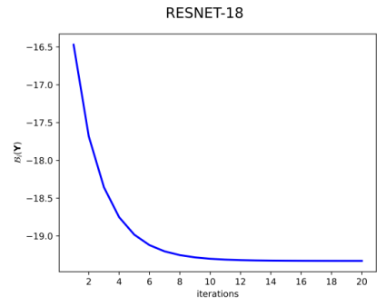

| Paper | https://arxiv.org/abs/2006.15486|
|--------|-|
| Code | https://github.com/imtiazziko/LaplacianShot |


# Main Idea

- **Transfer Learning:** Image embeddings are obtained by pre-training a network on the set of base classes using cross-entropy loss.

- **Transductive Inference:** Jointly classify all the query examples together.

# Methodology

Given a labeled support set $\mathbb{X_s} = \bigcup_{c=1}^C$ with C _test_ classes, where each novel class $c$ has $|\mathbb{X_s^c}|$ labeled examples. Ex., $|\mathbb{X_s^c}| = 1$ for one-shot learning. The object is then to classify unlabeled unseen query sample set $|\mathbb{X_q}|$. 

Let $f_{\theta}$ be the embedding function with parameters $\theta$. Then:

$$x_q = f_{\theta}(z_q) \in \mathbb{R}^M,$$
where $x_q$ is the encoding of the data point $z_q$.

For each query point $x_q$, let there be a assignment vector $\mathbf{y_q} = [y_{q,1}, ..., y_{q,C}]^t \in \{0,1\}^C$

so that binary $y_{q,c}$ is equal to 1 if $x_q$ belongs to class $c$. Then $\mathbf{Y}$ denotes the $N \times C$ matrix whose rows are formed by $\mathbf{y}_q$, where $N$ is the number of query points  in $\mathbb{X_q}$. Then the objective to minimize at inference is given by (to find a $\mathbf{Y}$ such that):

$$\mathcal{E}(\mathbf{Y}) = \mathcal{N}(\mathbf{Y}) + \frac{\lambda}{2} \mathcal{L}(\mathbf{Y})$$

where 

$$\mathcal{N}(\mathbf{Y}) = \sum_{q=1}^N \sum_{c=1}^C y_{q,c}  d(x_q - \mathbf{m}_c)$$

and 

$$\mathcal{L}(\mathbf{Y}) = \frac{1}{2} \sum_{q,p} w(x_q, x_p) || \mathbf{y}_q - \mathbf{y}_p||^2$$

- $\mathcal{N}(\mathbf{Y})$ is minimized globally when each query point is assigned to the class of the nearest prototype $\mathbf{m}_c$ from the support set using a distance metric $d(x_q, m_c)$.
- The Laplacian term (regularizer), $\mathcal{L}(\mathbf{Y})$, encourages nearby points $(x_p, x_q)$ in the label space to the same latent label assignment. $w$ is any similarity metric.
- $\lambda$ is regularization parameter whose value is found by measuring performance on validation set.


Using an iterative bound optimization procedure (Ex., Expectation-Maximization (EM)), $\mathcal{E}(\mathbf{Y})$  is minimized and $\mathbf{Y}$ is found. Their optimization procedure converges within 15 iterations. Please refer to the paper for details on optimization method.

# Results

|Network| dataset | 1-shot | 5-shot|
|-------|----------|---------|--------|
| ResNet-18 | *mini*ImageNet | $72.11 \pm 0.19$| $82.31 \pm 0.14$ |
| ResNet-18 | *tiered*ImageNet | $78.98 \pm 0.21$| $86.39 \pm 0.16$ |
| ResNet-18 | CUB | $80.96$ | $88.68$ |
| ResNet-18 | *mini*ImageNet $\rightarrow$ CUB[^*] | $55.46$ | $66.33$ |

[^*]: Cross Domain FSL: Training on miniImageNet and testing on CUB.





# Cite / BibTex

```
@article{Ziko2020LaplacianRF,
  title={Laplacian Regularized Few-Shot Learning},
  author={Imtiaz Masud Ziko and Jose Dolz and {\'E}ric Granger and Ismail Ben Ayed},
  journal={ArXiv},
  year={2020},
  volume={abs/2006.15486}
}
```